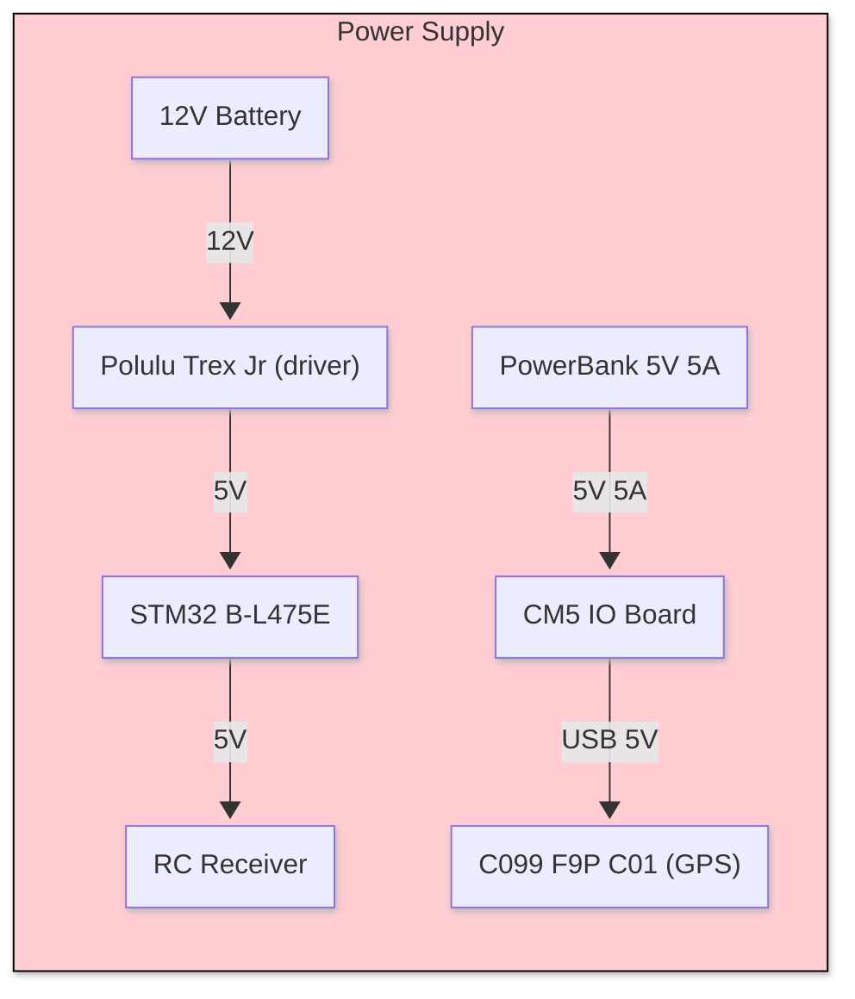
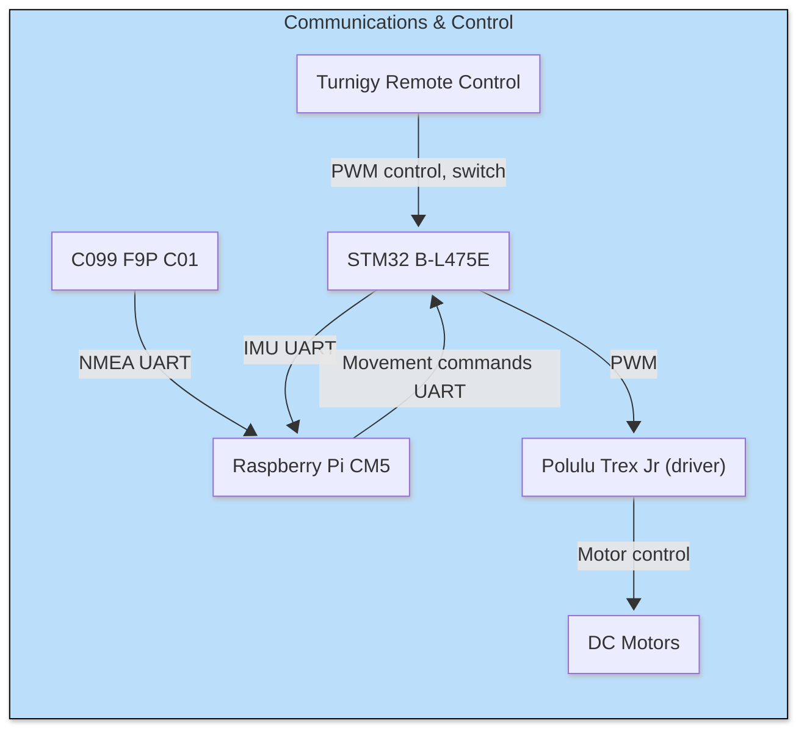
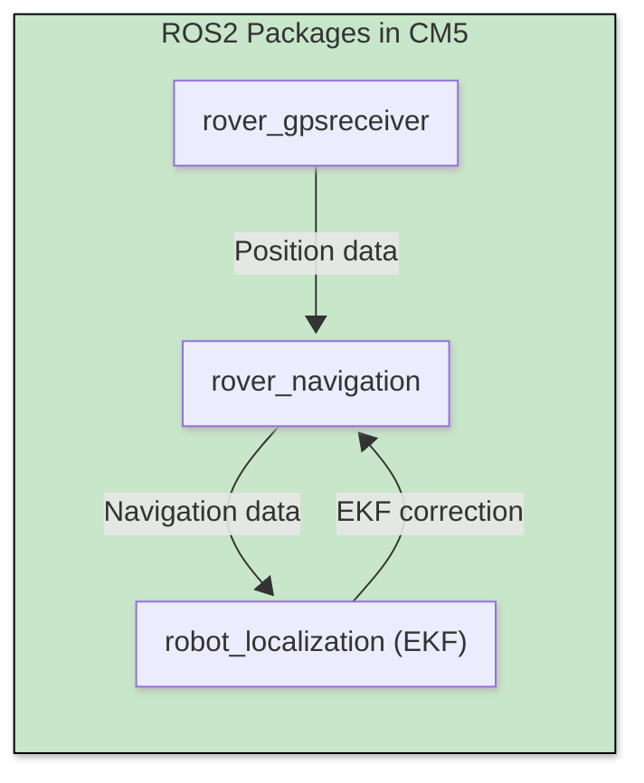

# Autonomous Rover with ROS2 🚀  
*ROS2-based robot for autonomous navigation*

## Current State 🧪  
**Functional Prototype** with core navigation capabilities:  

- ✅ Manual Control and Switch for autonomous navigation
- ✅ Simultaneous Localization and IMU
- ✅ Autonomous navigation with waypoints
- ❌ RTK correction 
- ❌ **Real-world deployment**
- ❌ video perception (e.g., object recognition)  

---

## Board Used ⚙️
- Raspberry Pi CM5 IO board with **ROS2 JAZZY** (Ubuntu 24.04)
- STM32 B-L475E
- UBlox C099 F9P
- Polulu Trex JR 

## Project Structure 📂

```
Ros2_Rover/
├── new_board_rover/         # STM32 Cube IDE project for the STM32 board
│
├── rover_autonomous/       # Core control ROS2 node
│   ├── config/
│   │   └── ekf.yaml        # kalman Filter configuration file
│   │
│   ├── include/
│   │
│   ├── launch/
│   │   └── navigation.launch.py        # Launch file
│   │
│   ├── src/
│   │   ├── nav_controller.cpp
│   │   └── serial_stm.cpp
│   │
│   ├── CMakeLists.txt
│   └── package.xml
│
├── rover_gpsreceiver/       # Core control ROS2 node
│   ├── include/
│   │
│   ├── launch/
│   │   └── gps.launch.py        # Launch file
│   │
│   ├── src/
│   │   ├── minnmea.c
│   │   ├── serial_nmea_publisher.cpp
│   │   └── nmea_parser.cpp
│   │
│   ├── CMakeLists.txt
│   └── package.xml
│
└── SQUARE.plan             # Waypoints map created with QGroundControl
```

## Installation & Setup 🛠️

1. Clone Repository
    ```bash 
    mkdir -p rover_ws/src
    git clone https://github.com/HDieTox/Ros2_Rover
    mv ./Ros2_Rover/rover_autonomous ./rover_ws/src
    mv ./Ros2_Rover/rover_gpsreceiver ./rover_ws/src
    mv ./Ros2_Rover/SQUARE.plan ./rover_ws/src
    ```
2. Build with colcon:
    ```bash 
    cd ./rover_ws && colcon build --symlink-install && . install/setup.bash
    ```
## Usage 🧭

in 2 different terminals in rover_ws/ : 

- `. install/setup.bash && ros2 launch rover_gpsreceiver gps.launch.py`
- `. install/setup.bash && ros2 launch rover_autonomous navigation.launch.py mission_file:=./src/SQUARE.plan`

## Graphical Recap





