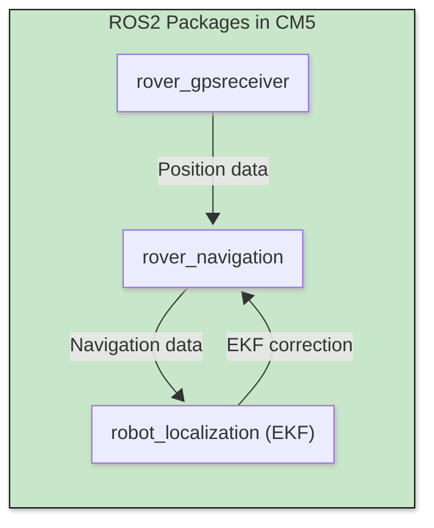

# Autonomous Rover with ROS2 🚀

*ROS2-based robot for autonomous navigation*

## Current State 🧪

**Functional Prototype** with core navigation capabilities:  

- ✅ Manual Control and Switch for autonomous navigation
- ✅ Simultaneous Localization and IMU
- ✅ Autonomous navigation with waypoints
- ❌ RTK correction
- ❌ **Real-world deployment**
- ❌ video perception (e.g., object recognition)  

---

## Project Structure 📂

```code
Ros2_Rover/
├── new_board_rover/         # STM32 Cube IDE project for the STM32 board
│
├── rover_autonomous/       # Core control ROS2 node
│   ├── config/
│   │   └── ekf.yaml        # kalman Filter configuration file
│   │
│   ├── include/
│   │
│   ├── launch/
│   │   └── navigation.launch.py        # Launch file
│   │
│   ├── src/
│   │   ├── nav_controller.cpp
│   │   └── serial_stm.cpp
│   │
│   ├── CMakeLists.txt
│   └── package.xml
│
├── rover_gpsreceiver/       # Core control ROS2 node
│   ├── include/
│   │
│   ├── launch/
│   │   └── gps.launch.py        # Launch file
│   │
│   ├── src/
│   │   ├── minnmea.c
│   │   ├── serial_nmea_publisher.cpp
│   │   └── nmea_parser.cpp
│   │
│   ├── CMakeLists.txt
│   └── package.xml
│
└── SQUARE.plan             # Waypoints map created with QGroundControl
```

## Installation & Setup 🛠️

1. Clone Repository

    ```bash
    mkdir -p rover_ws/src
    git clone https://github.com/HDieTox/Ros2_Rover
    mv ./Ros2_Rover/rover_autonomous ./rover_ws/src
    mv ./Ros2_Rover/rover_gpsreceiver ./rover_ws/src
    mv ./Ros2_Rover/SQUARE.plan ./rover_ws/src
    ```

2. Build with colcon:

    ```bash
    cd ./rover_ws && colcon build --symlink-install && . install/setup.bash
    ```

## Usage 🧭

in 2 different terminals in rover_ws/ :

- `. install/setup.bash && ros2 launch rover_gpsreceiver gps.launch.py`
- `. install/setup.bash && ros2 launch rover_autonomous navigation.launch.py mission_file:=./src/SQUARE.plan`

## Board Used ⚙️

- Raspberry Pi CM5 IO board with **ROS2 JAZZY** (Ubuntu 24.04)
- STM32 B-L475E
- UBlox C099 F9P
- Pololu Trex JR

## Pin Configuration

## Utilisation des Pins par Board

### STM32 B-L475E

| Pin       | Function           | Description                         |
|-----------|--------------------|-------------------------------------|
| PA0       | PWM Signal         | Motor 1 command to Trex Jr driver   |
| PA1       | PWM Signal         | Motor 2 command to Trex Jr driver   |
| PC4       | USART1 TX          | TX connection from IMU to CM5       |
| PC5       | USART1 RX          | RX connection of commands from CM5  |
| PA6       | PWM Input          | Channel 1 Receiver RC               |
| PA7       | PWM Input          | Channel 2 Receiver RC               |
| PB1       | PWM Input          | Channel 4 Receiver RC (switch)      |
| GND       | Ground             | Common ground with CM5              |
| 5V        | 5V Power           | Sent to RC Receiver                 |
| GND       | Ground             | Common ground with RC Receiver      |
| VIN       | 5V Power           | Received via Trex Jr regulator      |
| GND       | Ground             | Common ground with Trex Jr regulator|

### Pololu Trex Jr (Driver)

| Pin    | Function          | Description                     |
|--------|-------------------|---------------------------------|
| RC1    | PWM Left Motor    | Left motor command              |
| RC2    | PWM Right Motor   | Right motor command             |
| 5V     | 5V Power          | Sent to STM32                   |
| GND    | Ground            | Common ground with STM32        |

**Jumpers:**

- Channel-Mix: OFF
- Mode-Select: Analog
- BEC: ON

### CM5 IO Board

| Pin/Port | Function        | Description                    |
|----------|-----------------|--------------------------------|
| USB 5V   | Power Supply    | Powers the GPS module C099     |
| GPIO8    | UART3 TX        | Command TX link to STM32       |
| GPIO9    | UART3 RX        | IMU RX link from STM32         |
| GPIO15   | UART0 RX        | GPS UART link to CM5           |
| GND      | Ground          | Common ground with STM32       |

### C099 F9P C01 (GPS)

| Pin/Port | Function        | Description                    |
|----------|-----------------|--------------------------------|
| USB      | 5V Power        | Powered by CM5 IO Board        |
| J9-2     | UART TX         | Sends GPS data to CM5          |

### Receiver RC

| Ch 1     | PWM             | Receiver signal input (Linear)               |
| Ch 2     | PWM             | Receiver signal input (Angular)              |
| Ch 4     | PWM             | Receiver signal input (Mode switch)          |

## Graphical Recap




## Documentation

|   Description   |     Link                                                                                                    |
|-----------------|-------------------------------------------------------------------------------------------------------------|
| Pololu Trex JR  | <https://www.pololu.com/product/767/resources>                                                              |
| UBlox C099 F9P  | <https://content.u-blox.com/sites/default/files/C099-F9P-AppBoard-ODIN-W2-uCX_UserGuide_(UBX-18055649).pdf> |
|  CM5 IO Board   | <https://datasheets.raspberrypi.com/cm5/cm5io-datasheet.pdf>                                                |
|  CM5 DataSheet  | <https://datasheets.raspberrypi.com/cm5/cm5-datasheet.pdf>                                                  |
|  STM32 B-L475E  | <https://www.st.com/en/evaluation-tools/b-l475e-iot01a.html>                                                |
